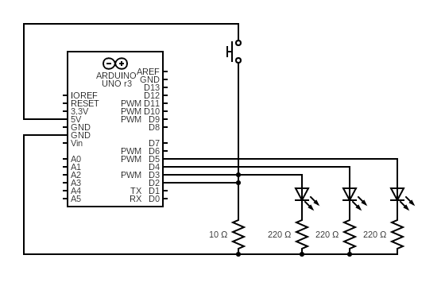

# Project 2 - Spaceship Interface

Name: TJ Rosario-Rosa
<!--
        Due:
 Start time: 
   End time:
    Elapsed:
-->

## Outline
<!-- Summarize the project in a clear, concise few sentences. -->
This project is designed to teach how to control LEDs behavior based on a switch. 


## Circuit Diagram
<!-- https://www.circuit-diagram.org/editor/ -->



## Code Walkthrough
<!-- Post and document important code here -->

We define our first variable here
```arduino
int switchState = 0
```
In the setup we define the inputs and outputs of the digital pins
```arduino
void setup(){
    pinmode(3, OUTPUT);
    pinmode(4, OUTPUT);
    pinmode(5, OUTPUT);
    pinmode(1, INPUT);
}
```
In this loop we execute the code required to get the LEDs blinking
```arduino
void loop(){
    switchState = digitalRead(2);
    if (switchState == LOW){  //the button is not pressed
        digitalWrite(3,HIGH); // Grn LED
        digitalWrite(4,LOW);  // Red LED
        digitalWrite(5,LOW);  // Red LED
    }
    else{                     // The button has been pressed
        digitalWrite(3,LOW); // Grn LED
        digitalWrite(4,HIGH);  // Red LED
        digitalWrite(5,HIGH);  // Red LED

    delay(250); //250 is a quarter of a second
    // Toggle LEDs
    digitalWrite(4,HIGH); 
    digitalWrite(5,LOW);
    }
}
```
When the code executes, the green LED starts off as ON while the button is not pressed. 
Once pressed, the green LED turns off and the red LEDs begin to flash.

## Applied Demo
<!-- Upload pictures that show that the project has worked -->
This is a picture of the breadboard and the Arduino


This is before the button is pressed


This is after the button is pressed


## Conclusion 
<!-- What went wrong/right? What can you do to make this better? How difficult did you find this project? -->
 - This project was very straight forward and I feel pretty confident going forward with the other projects.
 - I could add other conditions like adding more buttons or LEDs as a way to expand on this project.
 - Difficulty: 2/10


