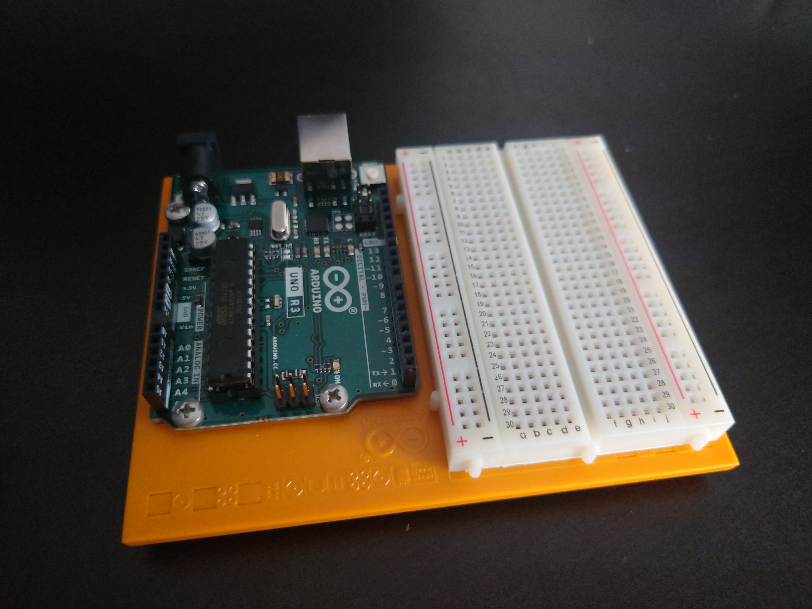
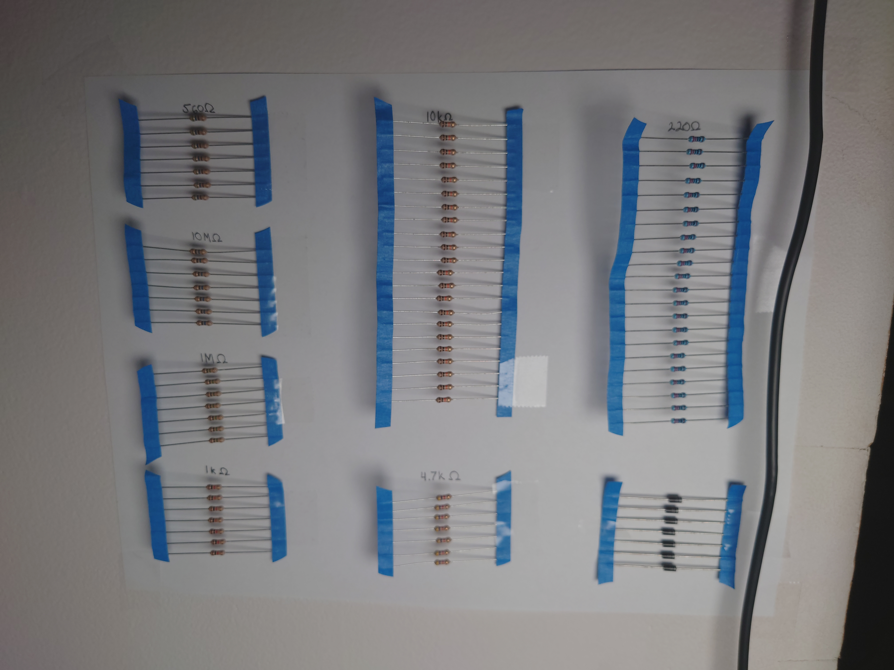
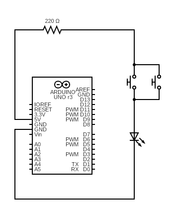
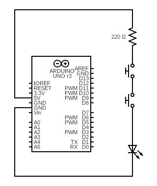

# Projects 0 and 1

Name: TJ Rosario-Rosa

[//]: # (This is a convoluted way of making a comment in markdown)

<!--
Test 
-->

## What parts are included in your kit?
- Arduino Uno
- Battery Snap
- Breadboard
- Capacitors
- DC Motor
- Diode
- Gels (Red, Green, Blue)
- H-Bridge
- Jumper Wires
- Light Emitting Diodes (LEDs)
- Liquid Crystal Display (LCD)
- Male Header Pin
- Optocoupler
- Piezo
- Photoresistor
- Potentiometer
- Pushbuttons
- Resistors
- Servo Motor
- Temperature Sensor
- Tilt Sensor
- Transistor
- USB Cable

## I will supply myself with the following:
 - 9v Battery

 ## I Have installed Arduino Software (IDE) 
 <input type="checkbox" disabled checked/> Yes

## Show off a picture of your workstation

## Assemble your Arduino and breadboard 

## Label your resistors

## What is this diagram depicting?
[//]: # (https://www.circuit-diagram.org/editor/)

A parallel circuit

## Build the circuit

## Draw a circuit in series

## Build the circuit
