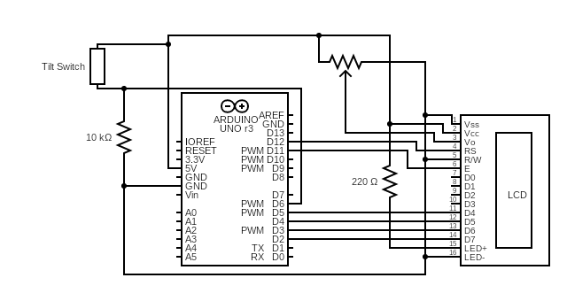
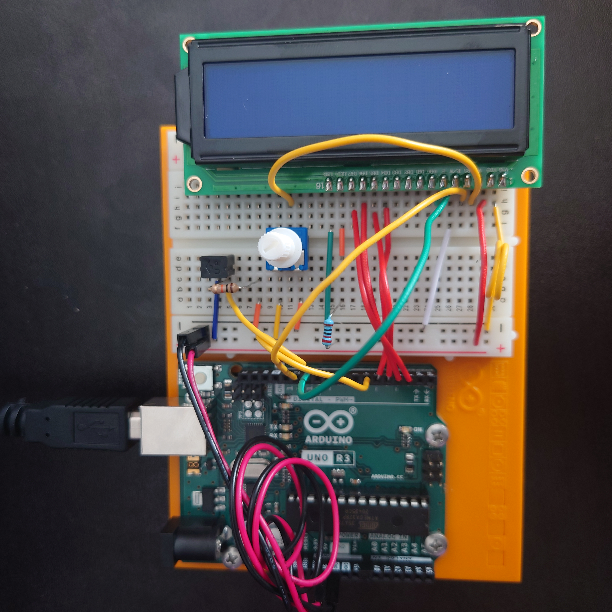

# Project 11 - Crystal Ball

Name: TJ Rosario-Rosa
<!--
        Due:
 Start time: 
   End time:
    Elapsed:
-->

## Outline
<!-- Summarize the project in a clear, concise few sentences. -->
This project is designed to introduce including libraries and liquid crystal displays.


## Circuit Diagram
<!-- https://www.circuit-diagram.org/editor/ -->



## Code Walkthrough
<!-- Post and document important code here -->
This was the first project that includes libraries for LCD screens.
```arduino
#include <LiquidCrystal.h>
``````

These functions were made possible with the included library
```arduino
LiquidCrystal lcd(12,11,5,4,3,2);
lcd.begin(16,2);
lcd.clear();
lcd.setCursor(0,1);
lcd.print("Crystal Ball!");
```


## Applied Demo
<!-- Upload pictures that show that the project has worked -->
This is a picture of the breadboard and the Arduino. The potentiometer sets the screen contrast, I found it messing with it almost immediately makes the display illegible.



The project in action


## Conclusion 
<!-- What went wrong/right? What can you do to make this better? How difficult did you find this project? -->
 - Wow. The circuit diagram on this one took pretty long. Protip: Add "Integrated Circuit 3" and delete all the positive numbers
 - Difficulty: 8/10
