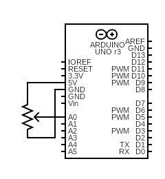

# Project 14 - Tweak the Logo

Name: TJ Rosario-Rosa
<!--
        Due:
 Start time: 
   End time:
    Elapsed:
-->

## Outline
<!-- Summarize the project in a clear, concise few sentences. -->
This project requires Processing (https://processing.org/) to be installed. It shows how to read the serial buffer in processing to be able to interpret the data received from a serial input and plug said data into processing functions.


## Circuit Diagram
<!-- https://www.circuit-diagram.org/editor/ -->



## Code Highlights
<!-- Post and document important code here -->

This is the whole Arduino .ino file. As you can see all this does is start a serial communication and write out a value from 0 to 255.
```arduino
void setup() {
  Serial.begin(9600);
}

void loop() {
  Serial.write(analogRead(A0)/4);
  delay(1);
}
```

Processing gets more involved. Now we import serial communication libraries, find the Arduino and assign it to myPort.

```processing
import processing.serial.*;
Serial myPort;
println(Serial.list());
myPort = new Serial(this, Serial.list()[0], 9600);
```

Then in the `void draw()` function we grab the the data that the Arduino is communicating and I deviated from the project by tinting a picture you'll be able to see in the demo.

```processing
  if (myPort.available()>0){
  bgcolor = myPort.read();
  println(bgcolor);
  }
  else{
  print("waiting?");
  }
  scale(3,3);
  tint(bgcolor,255,255);
  image(logo, 0, 0);
```

## Applied Demo
<!-- Upload pictures that show that the project has worked -->
This is a picture of the breadboard and the Arduino


The code in action


## Conclusion 
<!-- What went wrong/right? What can you do to make this better? How difficult did you find this project? -->
 - The crossover into processing was a welcome surprise! I look forward to applying this to my processing projects to have more unique control over them.
 - This class would benefit greatly from having multimedia programming (CSC 220) as a prerequisite or at least a "nice to have" before taking.
 - Difficulty: 3/10
