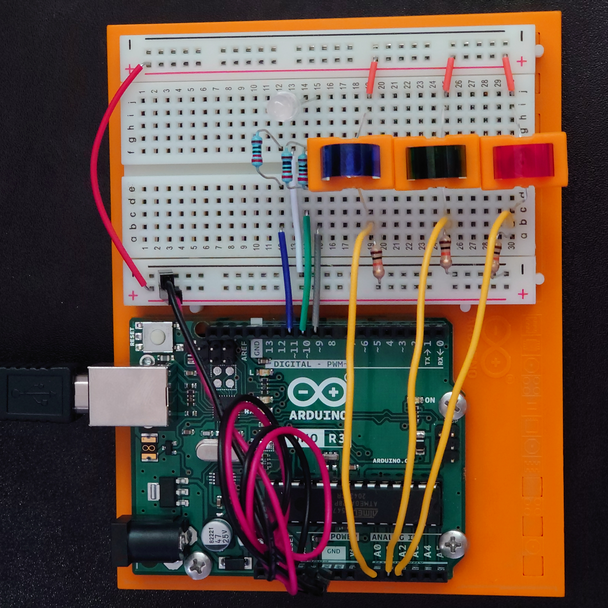

# Project 4 - Color Mixing Lamp

Name: TJ Rosario-Rosa
<!--
        Due:
 Start time: 
   End time:
    Elapsed:
-->

## Outline
<!-- Summarize the project in a clear, concise few sentences. -->
This project is designed to show the use of Pulse Width Modulation (PWM) and introduces photoresistors.


## Circuit Diagram
<!-- https://www.circuit-diagram.org/editor/ -->


## Code Highlights
<!-- Post and document important code here -->
Last project taught the use the analog controllers, but the function of note here allows PWM components to be controlled.
```arduino
analogWrite(redLEDPin, redValue);
analogWrite(greenLEDPin, greenValue);
analogWrite(blueLEDPin, blueValue);
```


## Applied Demo
<!-- Upload pictures that show that the project has worked -->
This is a picture of the breadboard and the Arduino



I used color changing lights to get the photoresistors to react faster


## Conclusion 
<!-- What went wrong/right? What can you do to make this better? How difficult did you find this project? -->
 - The implementation of the photoresistors with "gel" and plastic bits is wonky at best. Carefully bend the transistors in a way that makes the plastic bits secured.
 - Difficulty: 4/10
