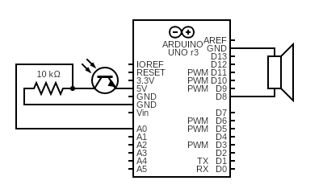
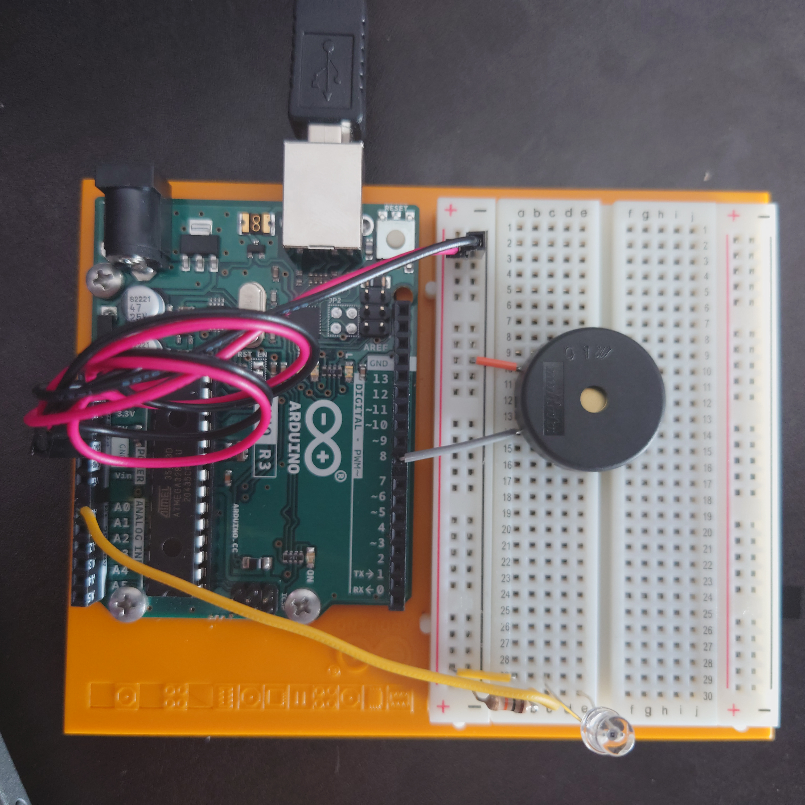

# Project 6 - Light Theremin

Name: TJ Rosario-Rosa
<!--
        Due:
 Start time: 
   End time:
    Elapsed:
-->

## Outline
<!-- Summarize the project in a clear, concise few sentences. -->
This project highlights another way to use the photoresistor and introduces the piezo speaker.


## Circuit Diagram
<!-- https://www.circuit-diagram.org/editor/ -->



## Code Walkthrough
<!-- Post and document important code here -->
The tone function plays a sound 
```arduino
tone(8,pitch,20);
```


## Applied Demo
<!-- Upload pictures that show that the project has worked -->
This is a picture of the breadboard and the Arduino



This is how the sensor is used, the sound produced is pitched depending on how much light the photoresistor is getting.


## Conclusion 
<!-- What went wrong/right? What can you do to make this better? How difficult did you find this project? -->
 - Had trouble getting this to work, for some reason the piezo speaker was producing an odd tone. Fixed it eventually after starting the code again and properly "calibrating" the photoresistor.
 - Difficulty: 3/10
