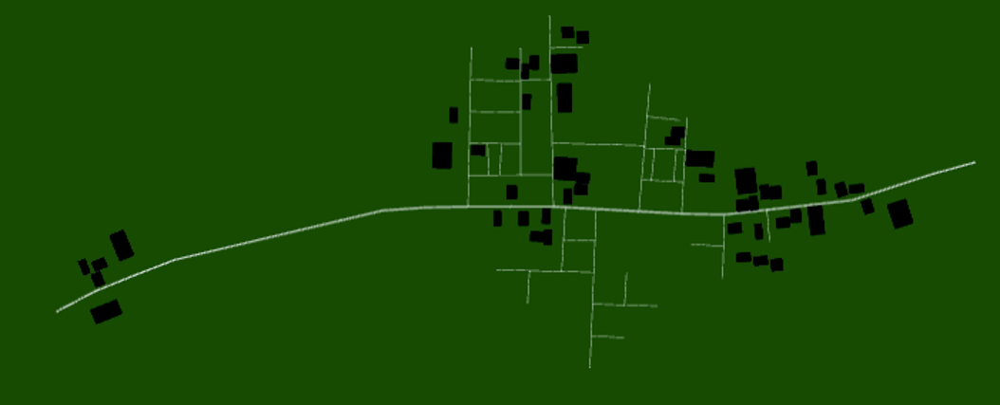

# Project Proposal

Name: TJ Rosario-Rosa
<!--
        Due:
 Start time: 
   End time:
    Elapsed:
-->

<!--
## Potential Project Ideas
 - LED that switches colors based on Wi-Fi information
 - IFTT Integration
 - Game Console Controller
 - Wireless 0-10v controller for LED ceiling light
 - Processing project cross-over with CSC 480 
 - Introductory machine learning cross-over project with CSC 447
## Project Idea
 -->

I will find a way to incorporate all of the classes I am taking this semester into this project.

<!---

- CSC 385 - Microcomputers

- CSC 480 - Advanced Multimedia Programming

- CSC 447 - Artificial Intelligence

- MAT 260 - Linear Algebra
-->

So I have come up with this:

## Mail Route

This three fold project is seeded generation of a street populated with buildings that must be travelled to. One building is the designated "post office" and all the buildings are marked with numbers. A random selection of buildings is selected and the shortest path must be determined to get from the post office to each building and back home.

- CSC 480 - Advanced Multimedia Programming
  * Processing is a free graphical library and integrated development environment that this project will be written in.
- CSC 447 - Artificial Intelligence
  * Using a search algorithm that determines the shortest path to multiple destinations 
- CSC 385 - Microcomputers
  * Building a controller that is the sole method of interacting with the sketch
  * 
- MAT 260 - Linear Algebra
  * The quaternions required for camera control (probably)