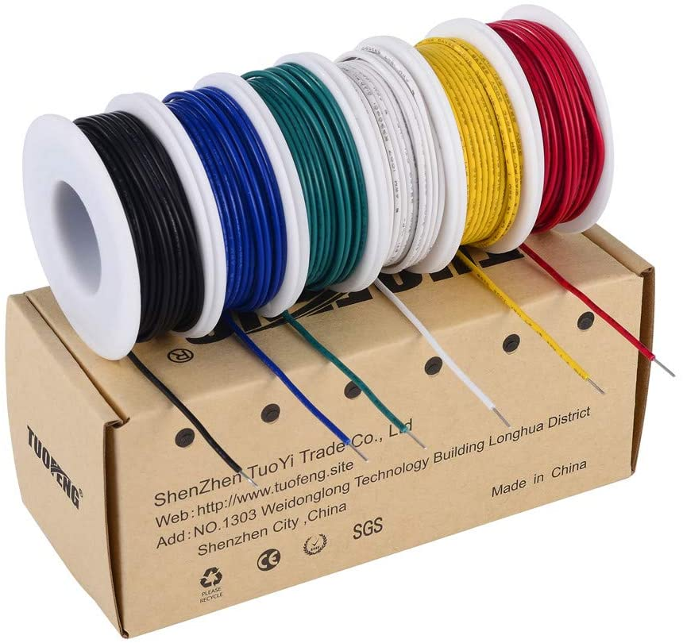

# Project 14 - Tweak the Logo

Name: TJ Rosario-Rosa
<!--
        Due: 12 -17-21
 Start time: 
   End time:
    Elapsed:
-->
## Bill of Parts/Materials

### Adafruit


[Adafruit 1.14" 240x135 Color TFT Display + MicroSD Card Breakout - ST7789](https://www.adafruit.com/product/4383)  $14.95


[Slide Potentiometer with Plastic Knob - 45mm Long - 10KΩ](https://www.adafruit.com/product/4272) $0.95 x 2


[Breadboard-friendly SPDT Slide Switch](https://www.adafruit.com/product/805) $0.95 x 2


[2-Axis Joystick](https://www.adafruit.com/product/245) $9.95


[Tactile Button switch (6mm) x 20 pack](https://www.adafruit.com/product/367) $2.50

### Amazon



[TUOFENG 22 awg Solid Wire-Solid Wire Kit](https://www.amazon.com/dp/B07TX6BX47) - $15.99


[TSEDY Wire Stripping Tool](https://www.amazon.com/dp/B07PY6JD3S) - $11.99


[Taiss 100 Pcs 6x6x6mm 2 Pin Panel PCB Momentary Tactile Tact Push Button Switch](https://www.amazon.com/dp/B08DQYKRJP) - $7.99


[Makeronics 7 in 1 Blue RAB Holder](https://www.amazon.com/dp/B083FPHRVW) - $15.90

`Items that were purchased but did not make it into this project were not included. `
## Outline
<!-- Summarize the project in a clear, concise few sentences. -->

The goal of this project was to create a controller capable of controlling a processing sketch. The serial output that is put out by the Arduino should be a method of interacting with the sketch. If possible, integration with the screen at any capacity would have just been a plus.


## Code Highlights
<!-- Post and document important code here -->

The library that Adafruit made for its 1.14" display was incredibly accessible for someone to pickup and run with.

```arduino
#include <Adafruit_GFX.h>    // Core graphics library
#include <Adafruit_ST7789.h> // Hardware-specific library for ST7789
```
The graphics test sketch is the default sample that users are given. In many circumstances, the code that was in said sketch was enough to do nearly anything a user needed.

```arduino
void mediabuttons() {
  // play
  tft.fillScreen(ST77XX_BLACK);
  tft.fillRoundRect(25, 10, 78, 60, 8, ST77XX_WHITE);
  tft.fillTriangle(42, 20, 42, 60, 90, 40, ST77XX_RED);
  delay(500);
  // pause
  tft.fillRoundRect(25, 90, 78, 60, 8, ST77XX_WHITE);
  tft.fillRoundRect(39, 98, 20, 45, 5, ST77XX_GREEN);
  tft.fillRoundRect(69, 98, 20, 45, 5, ST77XX_GREEN);
  delay(500);
  // play color
  tft.fillTriangle(42, 20, 42, 60, 90, 40, ST77XX_BLUE);
  delay(50);
  // pause color
  tft.fillRoundRect(39, 98, 20, 45, 5, ST77XX_RED);
  tft.fillRoundRect(69, 98, 20, 45, 5, ST77XX_RED);
  // play color
  tft.fillTriangle(42, 20, 42, 60, 90, 40, ST77XX_GREEN);
}
```
Above is a sample of a few shapes arranged to look like play and pause buttons.

All the previous projects built to this point and lead me to this finished product. The only real heavy part aside from serial communication and the screen was figuring out the multiple button inputs. This is where I must give credit to [the-diy-life.com](https://www.the-diy-life.com/multiple-push-buttons-on-one-arduino-input/) which had an excellent article detailing exactly how I should go about it. The end result was reading in inputs of four buttons with resistors from an analog pin and comparing the value output.

## Applied Demo
<!-- Upload pictures that show that the project has worked -->
This is a picture of the breadboard and the Arduino


The screen in action


## Conclusion 
<!-- What went wrong/right? What can you do to make this better? How difficult did you find this project? -->
 - Processing had some quirks that I needed to work out, but seeing as I saved integration until the end and this was my first time using processing's python mode, I was unable to finish within my set timeframe. That being said, all functions were able to be tested, displayed and sent through the serial port so I consider this project a success.

- The screen ended up being one of the main points of the project. 

- I was very glad I purchased the spool kit. It came in very handy when I noticed my board was starting to look cluttered and confusing.