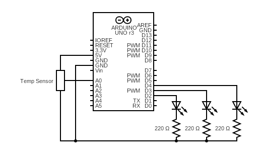

# Project 3 - Love-o-Meter

Name: TJ Rosario-Rosa
<!--
        Due:
 Start time: 
   End time:
    Elapsed:
-->

## Outline
<!-- Summarize the project in a clear, concise few sentences. -->
This project is designed to show the Arduino reads in information from an analog sensor and familiarizes with the serial monitor.


## Circuit Diagram
<!-- https://www.circuit-diagram.org/editor/ -->



## Code Highlights
<!-- Post and document important code here -->
To be able to use the analog controller this was the first command written in the setup function
```arduino
Serial.begin(9600);
```
This line sets the analog value to an int variable
```arduino
  int sensorVal = analogRead(sensorPin);
```
Important to mention that a delay is heavily recommended because of how frequently the Arduino reads from the analog sensor
```arduino
  delay(1);
```


## Applied Demo
<!-- Upload pictures that show that the project has worked -->
Had to replace the temperature sensor with a potentiometer


## Conclusion 
<!-- What went wrong/right? What can you do to make this better? How difficult did you find this project? -->
 - Other users on the Arduino forums were missing the temperature sensor and recommended a potentiometer to replace it.
 - Calibration of the temperature sensor sounds like it would have been interesting to get into if I had the temp sensor.
 - Difficulty: 2/10
